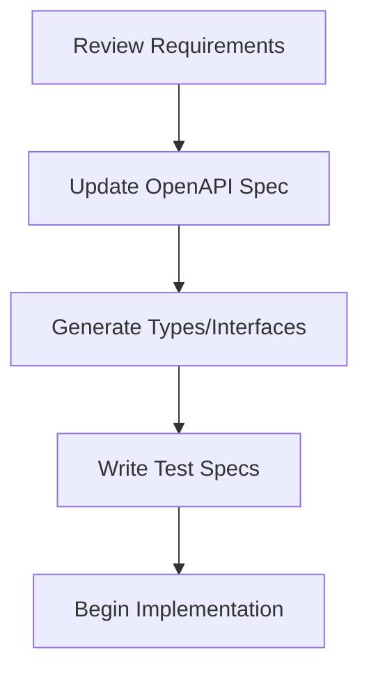
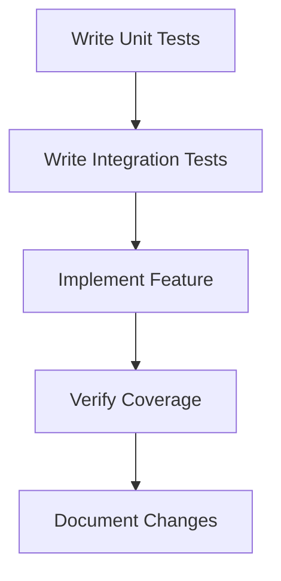

# Cursor Development Workflow

## Feature Implementation Flow

### 1. Specification First


### 2. Test-Driven Development


### 3. Implementation Checklist
- [ ] OpenAPI spec updated
- [ ] Types/interfaces defined
- [ ] Test cases written
- [ ] Core implementation complete
- [ ] Error handling verified
- [ ] Documentation updated

### 4. Quality Gates
Each feature must pass:
- Test coverage ≥ 80%
- Type safety checks
- OpenAPI validation
- Documentation completeness
- Performance benchmarks

### 5. Documentation Requirements
- OpenAPI annotations
- JSDoc comments
- README updates
- Architecture notes
- Breaking change docs

## Cursor Agent Instructions

### Input Format
```
TASK:
[Clear task description]

CONTEXT:
- Relevant files/components
- Business requirements
- Technical constraints

REQUIREMENTS:
1. [Specific requirement]
2. [Edge cases to handle]
3. [Performance needs]

TESTS:
- Unit test scenarios
- Integration test cases
- Coverage expectations
```

### Output Format
```
ANALYSIS:
- Implementation approach
- Affected components
- Potential risks

IMPLEMENTATION:
1. OpenAPI changes
2. Type definitions
3. Test implementations
4. Core feature code
5. Documentation updates

VERIFICATION:
- Test coverage report
- Type safety checks
- Performance metrics
``` 