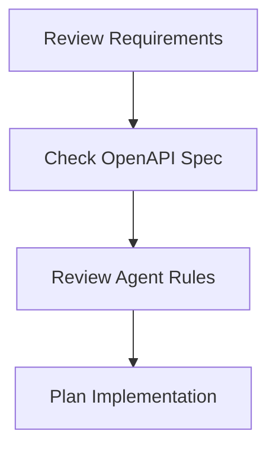
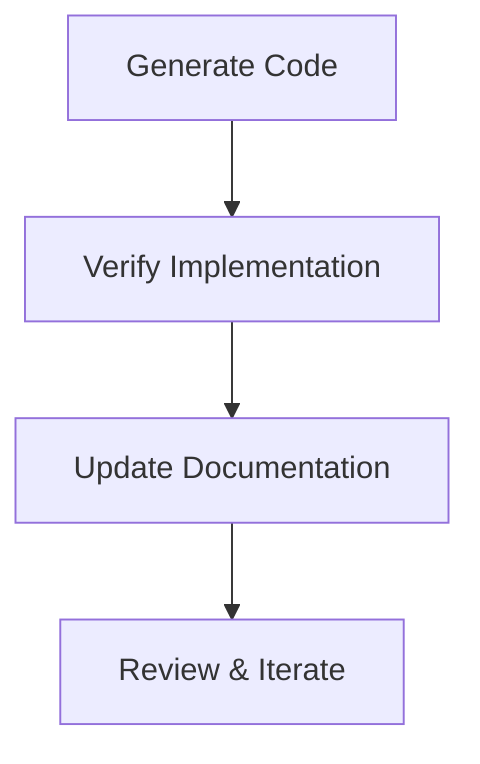
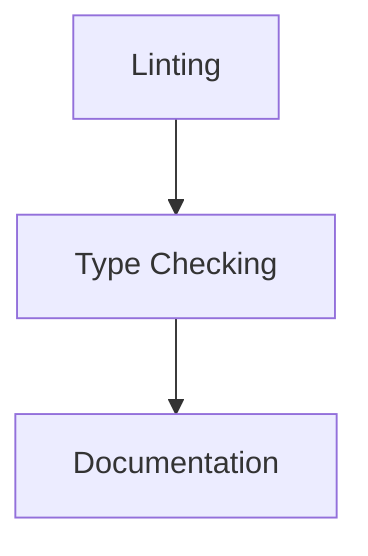
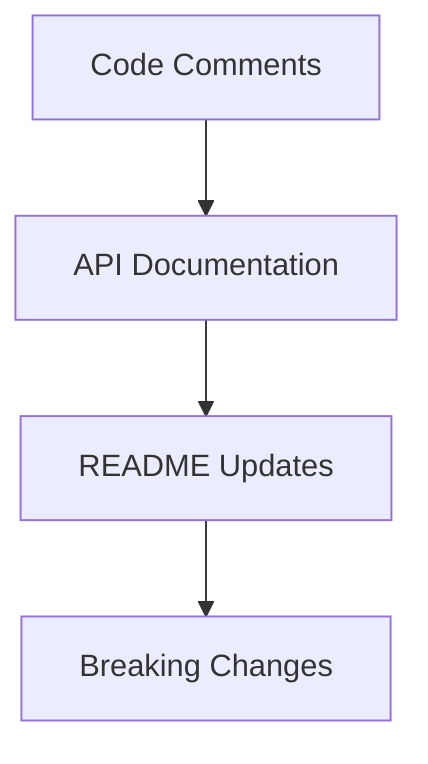

# Master Development Workflow

## Overview
This document serves as the central reference for development processes, combining agent rules, development workflows, and coding standards.

## Process Flow

### 1. Pre-Development


### 2. Development Cycle


## Workflow Checklist

### Initial Setup
- [ ] Review OpenAPI specification
- [ ] Check existing implementations
- [ ] Plan implementation approach

### Implementation
- [ ] Follow coding standards
- [ ] Implement type-safe code
- [ ] Handle errors appropriately
- [ ] Add proper logging
- [ ] Document code

### Documentation
- [ ] Update OpenAPI spec if needed
- [ ] Add/update JSDoc comments
- [ ] Update README if needed
- [ ] Document breaking changes

### Review Process
- [ ] Run linter
- [ ] Self-review code
- [ ] Request AI review
- [ ] Address feedback

## AI Agent Integration

### Context Requirements
When working with the AI agent, provide:

1. Relevant file contents
2. Clear task description
3. Affected components
4. Expected behavior

### Code Generation Rules

#### Input Format
```
Task: [Clear description of what needs to be done]
Context: [Relevant background information]
Files: [List of affected files]
Requirements:
- [Specific requirement 1]
- [Specific requirement 2]
```

#### Output Verification
- [ ] Matches coding standards
- [ ] Includes proper types
- [ ] Handles errors
- [ ] Properly documented

## Quality Gates

### 1. Code Quality


#### Requirements
- Linting passes
- No type errors
- Documentation complete

### 2. Documentation


## Troubleshooting

### Common Issues
1. Type Errors
   - Review type definitions
   - Check import paths
   - Verify generic types

2. Coverage Issues
   - Check excluded files

## Reference

### Related Documents
- [Coding Standards](./guides/coding_standards.md)
- [Development Workflow](./guides/development_workflow.md)
- [Agent Rules](../architecture/agent_rules.md)

### Tools
- TypeScript
- Vite
- ESLint
- Prettier
- Cursor AI

### Resources
- OpenAPI Specification
- TypeScript Documentation


